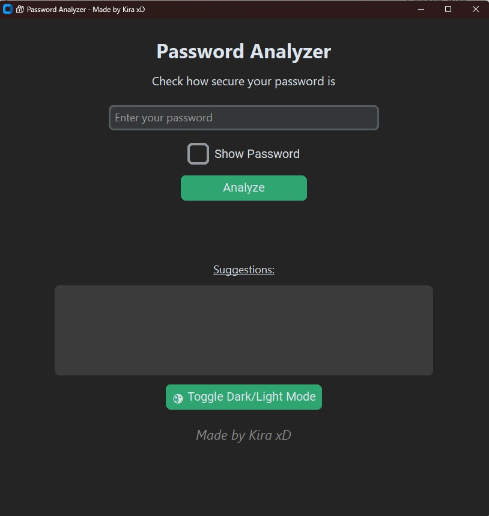

# 🔐 Password Analyzer GUI

> Hack your own passwords — before someone else does.  
> A sleek Python GUI app to check password strength with real-time feedback. Built using CustomTkinter.

---

### ✅ Download Ready-to-Use `.exe`

No Python setup needed! Just download and run:

**[Download Password Analyzer (.exe) from Google Drive](https://drive.google.com/file/d/1VdHhwsuCIyiP1fRpJ0D-a4Cpehqt9g0o/view?usp=sharing)**


---

### Features
- Live password strength analysis (Very Weak to Very Strong)
- Suggestions to improve weak passwords
- Toggle show/hide password input
- Light/Dark mode switch
- Interactive fade-in effect
- Clickable GitHub footer
- Made with love by **Kira xD**


### Demo
Coming soon...

### Screenshot


### Installation

```bash
git clone https://github.com/KiraxD/Password-Analyzer-GUI.git
cd Password-Analyzer-GUI
pip install -r requirements.txt
python password_analyzer_gui.py
